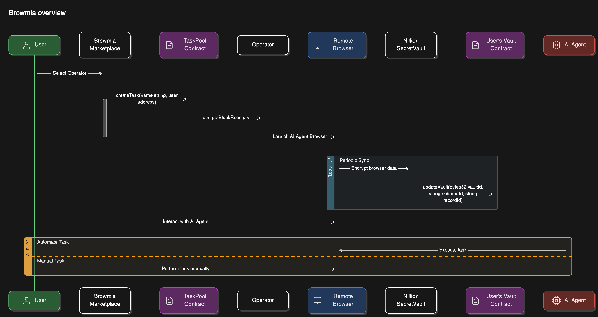
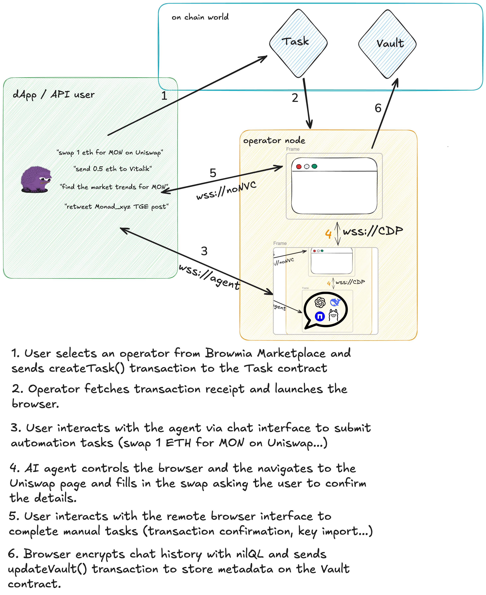

<a href="https://browmia-dapp.fly.dev" target="_blank" rel="noopener">
  <picture>
    <source media="(prefers-color-scheme: dark)" alt="Browmia" srcset="https://i.postimg.cc/TYwhCX1z/browmia-1.png" />
    
  </picture>
</a>

<h4 align="center">
  <a href="https://browmia-dapp.fly.dev">Browmia dApp</a> |
  <a href="#technical-design">Technical Docs</a>
</h4>

<div align="center">
  <h2>
    A decentralized AI Agent browser marketplace designed for secure, private, and modular web automation. 
 </br>
  <br />
  </h2>
</div>

<br />
<p align="center">
  <a href="https://github.com/quadsum/browmia/blob/master/LICENSE">
    
  </a>
  <a href="https://github.com/quadsum/browmia/blob/master">
    
  </a>
</p>

<div align="center">
  <figure>
    <a href="https://github.com/quadsum/browmia/blob/master" target="_blank" rel="noopener">
      
    </a>
    <figcaption>
      <p align="center">
        Automate browsing tasks with your desired chat agent.
      </p>
    </figcaption>
  </figure>
</div>

## Table of Contents

1. [Demo app](#demo-app)
2. [Quickstart](#quickstart)
3. [Technical design](#technical-design)
4. [License](#license)

## Demo app

Give it a spin by visiting the demo application at [https://browmia-dapp.fly.dev](https://browmia-dapp.fly.dev)

## Quickstart

### Launch a new AI Agent Browser

<h4 align="left">
  <a href="./smart-contracts/README.md">Visit the Smart Contract README for installation and deployment.</a>
</h4>


Send a `createTask()` transaction for signaling the creation of a new browser task.

```bash
 export DIAMOND_ADDRESS=0x64942Ac86b6B87Eb5BD14B9023F554746eF7639b
 export RPC_URL=https://testnet-rpc.monad.xyz
 export USER_ADDRESS=0xbeef
 cast send $DIAMOND_ADDRESS \
   "createTask(string,address)(bytes32)" \
   "my-cool-task-name" \
   "$USER_ADDRESS" \
   --rpc-url $RPC_URL \
   --interactive
```

Once up and running, interact with your browser via the [dApp browser interface](https://browmia-dapp.fly.dev/browser/0xbeef) as you would with your standard browser. 

### Operator

<h4 align="left">
  <a href="./operator/README.md">Visit the Operator README for more details</a>
</h4>

Git clone the browmia repo locally:

```sh
git clone recurse-submodules https://github.com/quadsum/browmia && cd browmia/operator
```

Configure the `.env.chrome ` file with your environment values and start up the node with docker.

```bash
docker compose --env-file .env.chrome -f docker-compose.yml up -d
```

Top up your operator wallet with some `MON` testnet. You can get them from [the Monad testnet faucet](https://testnet.monad.xyz)

Note that in the initial Browmia implementation, new operator applications need to be reviewed and whitelisted. If you are interested, please fill the [Register Operator form](https://browmia-dapp.fly.dev/explorer) with your details.


## Technical design

> ***The high-level technical design of the Browmia protocol's first implementation***
 

High-level depiction of the technical architecture implementing the Browmia Protocol.





The architecture leverages a **modular Diamond pattern** of deployed smart contracts to the `Monad testnet network` to manage marketplace operations, including tasks creation, operator registration, and decentralized storing.

Operators have a critical role in securing Browmia decentralized network. They provide secure and isolated virtual browser infrastructure. To ensure high-quality performance from operators, Browmia aims to incentivize operators more if they are proven more accurate.

These browsers come equipped with AI Agent automation, noVNC remote access, data encryption, among other features. Operators create a decentralized network of different browser flavours, that allow users to transparently select one operator for securely and privately browsing from anywhere.

### User flow




Under the hood, the user sends a `createTask(name string, user address)` tx to the `Task`contract.
The operator node picks up the `tx_receipt` for the relevant `topic` and spins up a new dedicated browser with a default timeout of `15min`. After it timeouts, it will gracefully shutdown the browser and send a `completeTask(user address)` tx, to signal the task was successfully completed. 

The current implementation relies on docker for running the containerized workloads.

Once the browser is up and running it exposes the following ports for allowing open connectivity to the outside world.


| Port  | Protocol | Purpose                                      |
|-------|----------|----------------------------------------------|
| 5901  | Websocket noVNC  | Allows remote web access control to the virtual browser       |
| 9222  | WebSocket CDP | Enables automation via the remote [CDP debugging protocol](https://chromedevtools.github.io/devtools-protocol) |
| 8765  | WebSocket | Allows external communication with the AI Agent

## Browser AI Agent interface

The **Browser dApp interface**  allows for full browser interaction and automation of browsing tasks via a dedicated agent chat.

Under the hood, the dApp establishes a websocket connection to the AI agent port and sends json payloads following this format:
 `{"role":"user"|"ai", "text": "", "timestamp": ""}`.

 The `browser-use` Python plugin provides the main AI Agent browser control functionalities. It has been rewritten into [a fork of browser-use](https://github.com/metatarz/browser-use) with the following additions: 
- Works for remote web chrome
- Human in the loop
- Runs as a websocket server enabling bidirectional communication human-agent.
- Enhancements in antibot detection

The chat history is stored at `TASK_DATA_PATH` env var, allowing for later plaintext retrieval encryption by the `encrypt-storage` plugin.


### Browser AI Agent supported models

#### Supported Models:
- **OpenAI GPT-4o** - [OpenAI Website](https://openai.com/)
- **Anthropic Claude 3.5** - [Anthropic Website](https://www.anthropic.com/)
- **Azure OpenAI GPT-4o** - [Azure OpenAI](https://azure.microsoft.com/en-us/products/cognitive-services/openai-service/)
- **Google Gemini 2.0** - [Google Gemini](https://deepmind.google/technologies/gemini/)
- **DeepSeek-V3 & DeepSeek-R1** - [DeepSeek Website](https://deepseek.com/)
- **Ollama** - [Ollama website](https://ollama.ai)

Each model requires its respective API key, which should be set in your environment variables before running the agent.

For more details, visit the [official browser-use documentation](https://docs.browser-use.com/customize/supported-models).

### Run in a Nillion SecretLLM Trusted Execution Environment

To enable [Nillion SecretLLM](https://docs.nillion.com/build/secretLLM/overview) Trusted Execution Environment, configure the following values:
-  `BROWSER_USE_OPENAI_API_KEY`: your nilAI API key
- `BROWSER_USE_OPENAI_API_BASE`:  a nilAI node URL, check [nilAI nodes](https://docs.nillion.com/network#nilai-nodes)
- `BROWSER_USE_OPENAI_MODEL`: to one of Nillion SecretLLM supported models. Currently the supported models are: `meta-llama/Llama-3.1-8B-Instruct` or `meta-llama/Llama-3.2-3B-Instruct`.


Code implementation: 
```py
# browmia/operators/plugins/browser-use/agent.py

model_name = os.getenv("OPENAI_MODEL", "gpt-4o-mini")
llm = ChatOpenAI(model=model_name)
```


## Decentralized secure storage 

The [encrypt-storage plugin](https://github.com/quadsum/browmia/blob/main/operator/plugins/encrypt-storage/README.md) syncs local to on chain states in a loop fashion.
The main process reads plaintext data at `TASK_DATA_PATH` and encrypts it with [nilQL](https://docs.nillion.com/build/nilQL). As a result, it produces encrypted data shares (one for each of the [Nillion SecretVault](https://docs.nillion.com/build/secret-vault) nodes) which are stored in the SecretVault alongside these fields:
`taskId`, `file`, `path`.

 For full examination of the format refer to the `/plugins/encrypt-storage/src/nillion/schema.json` json schema file.

 Eventually, the metadata fields (`schemaId` and `recordId`) are stored onchain by calling  `updateVault()` tx in the `Vault` contract.

This enables anyone that has a valid `nilQL secretKey` to decrypt its contents.

For this reason and to preserve data privacy, users can also mount their own `Vaults` by generating a unique `SecretVault key` in the browser creation context. This is later on distributed to the selected operator at runtime.

 Finally, the vault can be decrypted or disposed as wished by the user.


## Smart Contract Design

A **Diamond Pattern Architecture**, enables flexible, upgradable smart contract functionalities for the Browmia protocol.
New contract deployments are handled by [Hardhat Ignition Modules](https://hardhat.org/ignition/docs/getting-started#overview)

Inspect and interact with the [Browmia diamond contract at Louper](https://louper.dev/diamond/0x64942Ac86b6B87Eb5BD14B9023F554746eF7639b?network=monadTestnet) deployed in Monad testnet.


```solidity
    struct DiamondStorage {
        // Existing Diamond management fields
        mapping(bytes4 => FacetAddressAndPosition) selectorToFacetAndPosition;
        mapping(address => FacetFunctionSelectors) facetFunctionSelectors;
        address[] facetAddresses;
        address contractOwner;

        // Task-related storage
        mapping(address => bytes32) userActiveTasks;
        mapping(bytes32 => Task) tasks;
        mapping(bytes32 => Vault) vaults;
        mapping(address => uint256) operatorTaskCount;
        address operatorPool;
        uint256 taskCounter;
    }

```
## License

MIT


